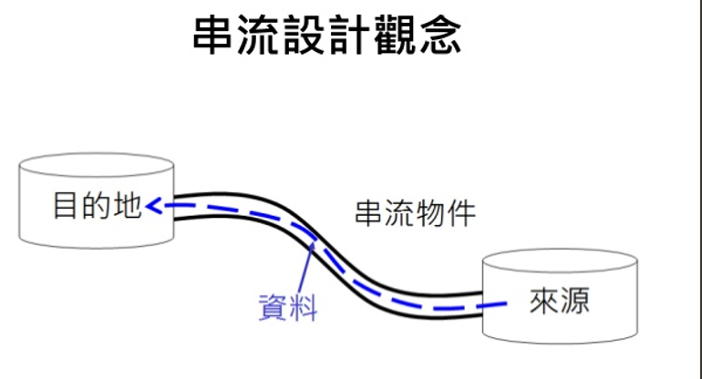
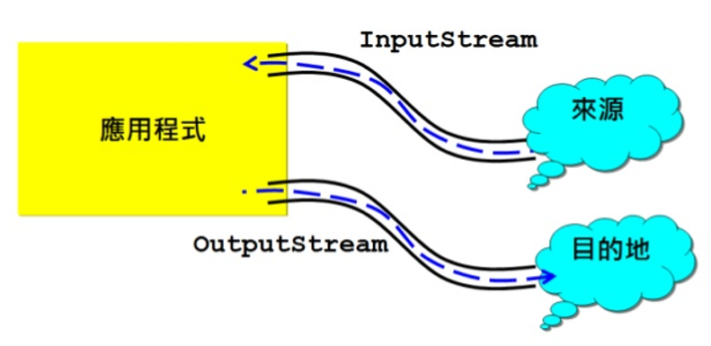
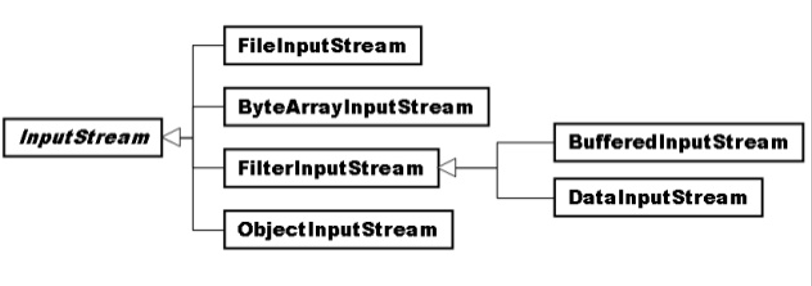
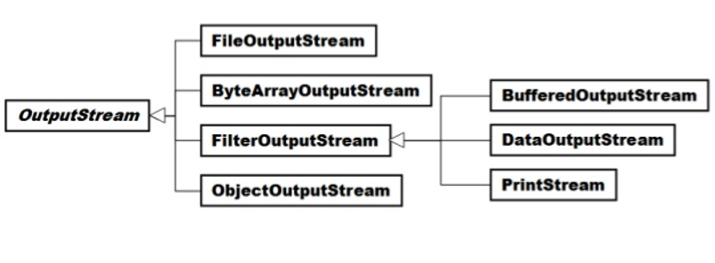
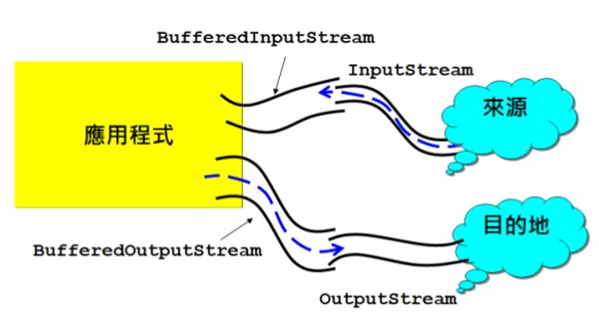
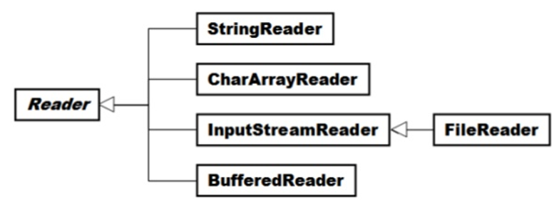
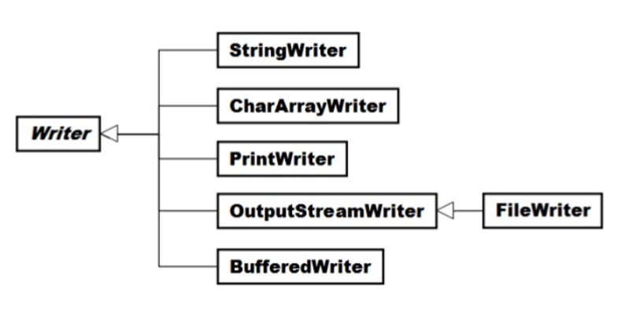

I/O
===
Thinking in Java Ch 18

## Outline

- [前言](#前言)
- [File Class](#file-class)
- [位元串流](#位元串流)
- [InputStream OutputStream](#inputstream-outputstream)
  + [FileInputStream FileOutputStream](#fileinputstream-fileoutputstream)
  + [ByteArrayInputStream ByteArrayOutputStream](#bytearrayinputstream-bytearrayoutputstream)
  + [FilterInputStream FilterOutputStream](#filterinputstream-filteroutputstream)
    * [BufferedInputStream BufferedOutputStream](#bufferedinputstream-bufferedoutputstream)
    * [DataInputStream DataOutputStream](#datainputstream-dataoutputstream)
    * [PrintStream](#printstream)
  + [ObjectInputStream ObjectOutputStream](#objectinputstream-objectoutputstream)

- [字元串流](#字元串流)
- [Reader Writer](#reader-writer)
  + [InputStreamReade OutputStreamWriter](#inputstreamreader-outputstreamwriter)
    * [FileReader FileWriter](#filereader-filewriter)
  + [BufferedReader BufferedWriter](#bufferedreader-bufferedwriter)
  + [CharArrayReader CharArrayWriter](#chararrayreader-chararraywriter)
  + [PrintWriter](#printwriter)
- [RandomAccessFile Class](#randomaccessfile-class)
- [管線化串流](#管線化串流)


## 前言

當使用程式軟體處理重要資料時，會與檔案的存取有莫大的關係，因為重要的資料最終要存放在檔案中。而且在有需要的時侯，程式還可以將檔案內的資料讀取出來，或再將更新過的資料存入檔案中。

Java 的 I/O 機制建立在串流（stream）的基礎之上，能有效簡化讀寫不同資料型態的程序。Java 為各種應用領域提供了各式各樣的串流， 串流的世界可分成兩大類型：用於讀寫二元資料的 InputStream 與 OutputStream ，以及用於讀寫文字的 Reader 與 Writer。Java 也提供了能讀取加密資料以及能自動壓縮資料。




## File Class

java.io.File 提供一個抽象的、與系統獨立的路徑表示，給它一個路徑字串，它會將它轉換為與系統無關的抽象路徑表示，這個路徑可以指向一個檔案或是目錄。

一個 File 的實例被建立時，它就不能再被改變內容，專門提供檔案、目錄管理的功能。例如，檔案的查詢、新增、修改與刪除等功能。File Class不能直接存取檔案內容，必須改用其他類別。例如：FileReader和FileWriter。

```java
import java.io.*;
public class FileDome {

	public static void main(String[] args) throws IOException{
		File dir = new File("txt");
		File file = new File(dir, "note.txt");
		if(!dir.exists()){
			System.out.print(dir.getName() + "目錄是否建立成功?");
			System.out.println(dir.mkdirs());
		}
		else
			System.out.print(dir.getName() + "目錄已存在");
		
		if(!file.exists()){
			System.out.print(file.getName() + "檔案是否建立成功?");
			System.out.println(file.createNewFile());
		}
		else
			System.out.print(file.getName() + "檔案已存在");
		
		File newFile = new File(file.getParent(), "comment.txt");
		System.out.println(file.getName() + "改名為" + newFile.getName());
		System.out.print("目錄是否修改成功?");
		System.out.println(file.renameTo(newFile));
		System.out.print(newFile.getName() + "檔案是否刪除成功?");
		System.out.println(newFile.delete());
		System.out.print(dir.getName() + "目錄是否刪除成功?");
		System.out.println(dir.delete());
	}
}
```

## 位元串流
- 資料都是以 0 與 1 的方式來儲存
- 非文字檔

## InputStream OutputStream

從程式的觀點來說，通常會將資料目的地（例如記憶體）與來源（例如檔案）之間的資料流動抽象化為一個串流（Stream），而當中流動的則是位元資料。



在 Java SE 中有兩個類別用來作串流的抽象表示：
- 輸入串流：java.io.InputStream
- 輸出串流：java.io.OutputStream

InputStream 是所有表示位元輸入串流的類別之**父類別**，它是一個**抽象類別**，繼承它的子類別要重新定義當中所定義的抽象方法。InputStream 是從裝置來源地讀取資料的抽象表示，例如System中的標準輸入串流 in 物件就是一個 InputStream 類型的實例，在 Java 程式開始之後，in 串流物件就會開啟，目的是從標準輸入裝置中讀取資料，這個裝置通常是鍵盤或是使用者定義的輸入裝置。



OutputStream 是所有表示位元輸出串流的類別之**父類別**，它是一個**抽象類別**，子類別要重新定義當中所定義的抽象方法，OutputStream 是用於將資料寫入目的地的抽象表示，例如 System 中的標準輸出串流物件 out 其類型是 java.io.PrintStream，這個類別是 OutputStream 的子類別（java.io.FilterOutputStream 繼承 OutputStream， PrintStream 再繼承 FilterOutputStream），在程式開始之後，out 串流物件就會開啟，您可以透過 out 來將資料寫至目的地裝置，這個裝置通常是螢幕顯示或使用者定義的輸出裝置。



```java
import java.io.*;
 
public class StreamDemo { 
    public static void main(String[] args) { 
        try { 
            System.out.print("輸入字元: "); 
            System.out.println("輸入字元十進位表示: " + 
                                    System.in.read());  
        } 
        catch(IOException e) { 
            e.printStackTrace(); 
        } 
    } 
} 
```

### FileInputStream FileOutputStream

- FileInputStream是InputStream的子類，與從指定的檔案中讀取資料至目的地有關，可以指定檔案名稱建構實例，一旦建構檔案就開啟， 接著就可用來讀取資料
- FileOutputStream是OutputStream的子類，與從來源地寫入資料至指定的檔案中有關，可以指定檔案名稱建構實例，一旦建構檔案就開啟， 接著就可以用來寫出資料
- 無論是FileInputStream或 FileOutputStream，不使用時都要使用close() 關閉檔案
- FileInputStream主要實作了 InputStream的read()抽象方法，使之可從檔案中讀取資料
- FileOutputStream主要實作了 OutputStream的write()抽象方法，使可寫出資料至檔案
- FileInputStream、 FileOutputStream在讀取、寫入檔案時， 是以位元組為單位

程式可以複製檔案，它會先從來源檔案讀取資料至一個 byte 陣列中，然後再將 byte 陣列的資料寫入目的檔案
```java
import java.io.*; 
 
public class FileStreamDemo {
    public static void main(String[] args) {
        try { 
            byte[] buffer = new byte[1024]; 

            // 來源檔案
            FileInputStream fileInputStream = new FileInputStream(new File(args[0])); 
            // 目的檔案
            FileOutputStream fileOutputStream = new FileOutputStream(new File(args[1])); 

            // available()可取得未讀取的資料長度
            System.out.println("複製檔案：" + fileInputStream.available() + "位元組"); 
            
            while(true) { 
                if(fileInputStream.available() < 1024) { 
                    // 剩餘的資料比1024位元組少
                    // 一位元一位元讀出再寫入目的檔案
                    int remain = -1; 
                    while((remain = fileInputStream.read())
                                           != -1) {
                        fileOutputStream.write(remain); 
                    }
                    break; 
                } 
                else { 
                    // 從來源檔案讀取資料至緩衝區 
                    fileInputStream.read(buffer); 
                    // 將陣列資料寫入目的檔案 
                    fileOutputStream.write(buffer); 
                } 
            } 

            // 關閉串流 
            fileInputStream.close(); 
            fileOutputStream.close(); 

            System.out.println("複製完成"); 
        } 
        catch(ArrayIndexOutOfBoundsException e) { 
            System.out.println("using: java FileStreamDemo src des"); 
            e.printStackTrace(); 
        } 
        catch(IOException e) { 
            e.printStackTrace(); 
        } 
    }
} 
```


### ByteArrayInputStream ByteArrayOutputStream

串流的來源或目的地不一定是檔案，也可以是記憶體中的一個空間，例如一個位元陣列，ByteArrayInputStream、ByteArray OutputStream 即是將位元陣列當作串流輸入來源、輸出目的地的類別。

```java
import java.io.*;
import java.util.*;

public class ByteArrayStreamDemo {
    public static void main(String[] args) {
        try { 
            File file = new File("test.txt"); 
            BufferedInputStream bufferedInputStream = new BufferedInputStream( new FileInputStream(file)); 
            ByteArrayOutputStream arrayOutputStream = new ByteArrayOutputStream(); 

            byte[] bytes = new byte[1];             

            // 將檔案內容寫入位元陣列串流
            while(bufferedInputStream.read(bytes) != -1) {
                arrayOutputStream.write(bytes);
            }
            arrayOutputStream.close(); 
            bufferedInputStream.close(); 

            // 以字元方式顯示位元陣列內容 
            bytes = arrayOutputStream.toByteArray(); 
            for(int i = 0; i < bytes.length; i++) {
                System.out.print((char) bytes[i]);
            }
            System.out.println(); 

            // 讓使用者輸入位置與字元修改位元陣列內容 
            Scanner scanner = new Scanner(System.in);

            System.out.print("輸入修改位置："); 
            int pos = scanner.nextInt();
            System.out.print("輸入修改字元："); 
            // 修改陣列中對應的字元
            bytes[pos-1] = (byte) scanner.next().charAt(0);

            // 將位元陣列內容存回檔案 
            ByteArrayInputStream byteArrayInputStream = new ByteArrayInputStream(bytes); 
            BufferedOutputStream bufOutputStream = new BufferedOutputStream( new FileOutputStream(file)); 
            byte[] tmp = new byte[1]; 
            while(byteArrayInputStream.read(tmp) != -1) 
                bufOutputStream.write(tmp); 
            byteArrayInputStream.close(); 
            bufOutputStream.flush(); 
            bufOutputStream.close(); 
        } 
        catch(ArrayIndexOutOfBoundsException e) { 
            System.out.println("請指定檔案名稱");
        } 
        catch(IOException e) { 
            e.printStackTrace(); 
        } 
    }
} 
```

### FilterInputStream FilterOutputStream
InputStream、rOutputStream提供串流的基本操作，如果想要為輸出輸入的資料作進一步處理，可使用以下類別：
- 具備緩衝區作用：BufferedInputStream、BufferedOutputStream
- 具備資料轉換處理：DataInputStream、DataOutputStream
- 具備資料顯示：PrintStream

#### BufferedInputStream BufferedOutputStream
在 FileInputStream、 FileOutputStream 的例子中，使用了一個 byte 陣列來作為資料讀入目的地，然後對陣列資料進行處理。為了效率起見，可以儘量讀取多一點的資料。以檔案存取為例的話，磁碟存取的速度是遠低於記憶體中的資料存取速度，為了減少對磁碟的存取，通常從檔案中一次讀入一定長度的資料，而寫入時也是一次寫入一定長度的資料，這可以增加檔案存取的效率。

BufferedInputStream 與 BufferedOutputStream 可以為 InputStream、OutputStream 類的物件增加緩衝區功能，建構 BufferedInputStream 實例時，需要給定一個 InputStream 型態的實例，操作 BufferedInputStream 時，實際上最後是操作 InputStream 實例，同樣的在建構 BufferedOutputStream 時，也需要給定一個 OutputStream 的實例，操作 BufferedOutputStream 時，實際上最後是操作 OutputStream 實例。

BufferedInputStream 的資料成員 buf 是個位元陣列，預設為 2048位 元組，當讀取資料來源時，例如檔案，BufferedInputStream 會儘量將 buf 填滿，當使用 read() 方法時，實際上是先讀取 buf 中的資料，而不是直接對資料來源作讀取，當 buf 中的資料不足時，BufferedInputStream 才會再操作給定的 InputStream 物件之 read() 方法，從指定的裝置中提取資料。

BufferedOutputStream 的資料成員 buf 是個位元陣列，預設為 512 個位元組，當使用 write() 方法寫入資料時，實際上會先將資料寫至 buf 中，當 buf 已滿時才會操作給定的 OutputStream 物件之 write() 方法，將 buf 資料寫至目的地，而不是每次都對目的地作寫入的動作。



```java
import java.io.*;
 
public class BufferedStreamDemo {
    public static void main(String[] args) {
        try {
            byte[] data = new byte[1]; 

            File srcFile = new File(args[0]); 
            File desFile = new File(args[1]); 

            BufferedInputStream bufferedInputStream = new BufferedInputStream(new FileInputStream(srcFile)); 
            BufferedOutputStream bufferedOutputStream = new BufferedOutputStream(new FileOutputStream(desFile));
 
            System.out.println("複製檔案：" + srcFile.length() + "位元組");

            while(bufferedInputStream.read(data) != -1) { 
                bufferedOutputStream.write(data); 
            }
            
            // 將緩衝區中的資料全部寫出 
            bufferedOutputStream.flush();
 
            // 關閉串流 
            bufferedInputStream.close(); 
            bufferedOutputStream.close(); 

            System.out.println("複製完成"); 
        } 
        catch(ArrayIndexOutOfBoundsException e) { 
            System.out.println("using: java UseFileStream src des"); 
            e.printStackTrace(); 
        } 
        catch(IOException e) { 
            e.printStackTrace(); 
        } 
    }
} 
```
BufferedInputStream、BufferedOutputStream 並沒有改變 InputStream 或 OutputStream 的行為，讀入或寫出時的動作還是 InputStream、OutputStream 負責，BufferedInputStream、BufferedOutputStream 只是在操作對應的方法之前，為它們加上一些額外功能（像是緩衝區功能）。

#### DataInputStream DataOutputStream

DataInputStream、DataOutputStream 可提供一些對 Java 基本資料型態寫入的方法，像是讀寫 int、double、 boolean 等的方法。

使用範例來直接介紹如何使用 DataInputStream 與 DataOutputStream，首先設計一個 Member 類別。
```java
package Data;
import java.io.*;

public class DataStreamDemo {
    public static void main(String[] args) {
        Member[] members = {new Member("Justin", 90), 
                              new Member("momor", 95), 
                              new Member("Bush", 88)}; 
        try { 
            DataOutputStream dataOutputStream = 
                new DataOutputStream( 
                         new FileOutputStream("member.txt")); 

            for(Member member : members) { 
               // 寫入UTF字串
               dataOutputStream.writeUTF(member.getName()); 
               // 寫入int資料
               dataOutputStream.writeInt(member.getAge()); 
            } 
            // 出清所有資料至目的地
            dataOutputStream.flush(); 
            // 關閉串流
            dataOutputStream.close(); 

            DataInputStream dataInputStream = 
                new DataInputStream( 
                         new FileInputStream("member.txt")); 
            // 讀出資料並還原為物件
            for(int i = 0; i < members.length; i++) { 
                // 讀出UTF字串
                String name = dataInputStream.readUTF(); 
                // 讀出int資料
                int score = dataInputStream.readInt();
                members[i] = new Member(name, score); 
            } 
            // 關閉串流
            dataInputStream.close(); 

            // 顯示還原後的資料
            for(Member member : members) { 
               System.out.printf("%s\t%d%n", 
                       member.getName(), member.getAge());
            } 
        } 
        catch(IOException e) { 
            e.printStackTrace(); 
        } 
    }
}
```
#### PrintStream
之前所介紹過的 OutputStream 物件，都是直接將記憶體中的資料原封不變的寫至目的地（例如一個檔案），下面的例子來說，如果將 int 型態 123 使用 OutputStream 物件輸出至檔案，則檔案中所儲存的是 int 型態 123 在記憶體中的值。產生一個 test.txt 檔案，開啟檔案之後，可能顯示怪異的符號。由於使用 write() 方法，這會將1在記憶體中的值之低位元組 0000001 寫入檔案中，而純文件檔案在顯示檔案內容時，會以作業系統的預設編碼顯示對應的字元。

。

```java
package print;
import java.io.*;

public class Test { 
    public static void main(String[] args) throws IOException { 
        FileOutputStream file = new FileOutputStream(new File("test.txt")); 
        file.write(123); 
        file.close(); 
    } 
} 
```


使用 java.io.PrintStream 可以自動進行字元轉換的動作，預設會使用作業系統的編碼來處理對應的字元轉換動作。print() 或 println() 接受 int、char、String、double 等資料型態。
```java
package print;
import java.io.*;

public class PrintStreamDemo {
    public static void main(String[] args) throws FileNotFoundException {
        PrintStream printStream = new PrintStream(new FileOutputStream(new File("test2.txt")));

        printStream.println(123);
        printStream.close();
    }
} 
```

### ObjectInputStream ObjectOutputStream

如果要直接儲存物件，定義該物件的類別必須實作 java.io.Serializable 介面，不過 Serializable 介面中並沒有規範任何必須實作的方法，所以這邊所謂實作的意義，其實像是對物件貼上一個標誌，代表該物件是「可序列化的」（Serializable）。

首先必須先實作一個 Book class

```java
package object;

import java.io.Serializable;

public class Book implements Serializable{
    private static final long serialVersionUID = 1L;
    String name;
    double price; 
    
    public Book(String name, double price){
    	this.name = name;
    	this.price = price;
    }
	public void show() {
		System.out.println("書名:" + name);
		System.out.println("定價:" + price);
	}
}
```
serialVersionUID 代表了可序列化物件的版本，如果沒有提供這個訊息，則實作 Serializable 介面的類別會自動依類別名稱、實現的介面、成員等來產生，如果是自動產生的，則下次更改 User (例如增加一個屬性)，則自動產生的 serialVersionUID 也會跟著變更，當從檔案讀回物件時，兩個物件的 serialVersionUID 不相同的話，就會丟出 java.io.InvalidClassException。

在寫入物件時，使用 writeObject() 方法，讀出物件時則使用 readObject() 方法，被讀出的物件都是以 Object 的型態傳回，所以必須將之轉換為物件原來的型態，才能正確的操作被讀回的物件。
```java
package object;
import java.io.*;

public class ObjectDemo {

	public static void main(String[] args) throws Exception{
		File file = new File("BookIn");
		Book[] books = new Book[2];
		books[0] = new Book("Java", 700);
		books[1] = new Book("C++", 600);
		FileOutputStream fos = new FileOutputStream(file);
		ObjectOutputStream oos = new ObjectOutputStream(fos);
		for(Object book : books)
			oos.writeObject(book);
		oos.close();
		fos.close();
		
		FileInputStream fis = new FileInputStream(file);
		ObjectInputStream ois = new ObjectInputStream(fis);
		System.out.println(file.getName() + "檔案內容如下:");
		try{
			while(true){
				((Book)ois.readObject()).show();
			}
		}
		catch(EOFException e){
			System.out.println("資料讀取完畢");
		}
		ois.close();
		fis.close();
	}
}

```
## 字元串流
## Reader Writer





### InputStreamReader OutputStreamWriter
#### FileReader FileWriter

### BufferedReader BufferedWriter
### CharArrayReader CharArrayWriter
### PrintWriter

## RandomAccessFile Class

## 管線化串流

PipedInputStream、PipedOutputStream、PipeReader、PipeWriter。這四種也是串流的一種，但必須等到了解多執行緒後才會了解他的價值。因為管線化 streams 被用於執行緒之間的通訊。
